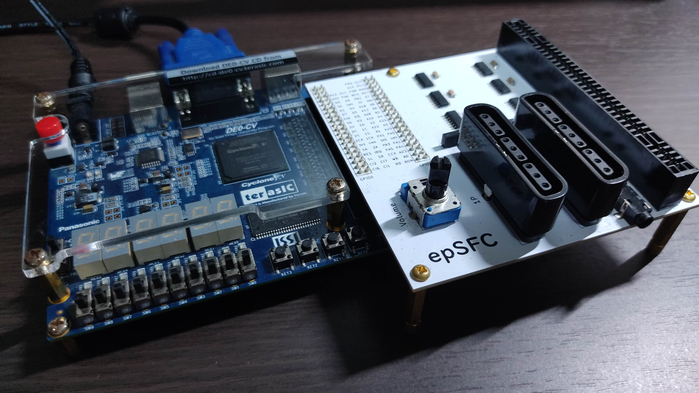

# epSFC - SUPER Famicom Emulator on an FPGA

epSFC is an implementation of Nintendo's __SUPER Famicom (SFC)__ written in SystemVerilog.
It works on an FPGA board with a board for connection to SFC cartridges.

The operation has been confirmed with Terasic DE0-CV Board.

 

")

